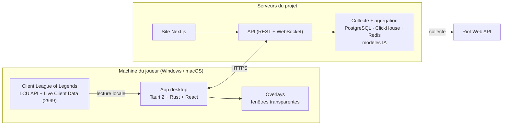

# Open LoL Companion

Application compagnon **League of Legends** gratuite et open source, pour **Windows et macOS**.

Draft assisté par IA, import automatique des runes, sorts et items, overlays en jeu, enregistrement des parties avec clips et replays, analyse post-game et site de statistiques. Tout est gratuit, sans publicité et sans abonnement.

> ⚠️ Projet en phase de cadrage : aucune version utilisable n'est encore publiée. Le cahier des charges complet est dans [`docs/cahier-des-charges.md`](docs/cahier-des-charges.md).

## Fonctionnalités prévues

| Module | Contenu |
| --- | --- |
| Draft (champion select) | Suggestions de picks notées contre la compo adverse, probabilité de victoire du draft, lane swap par glisser-déposer |
| Import de builds | Runes, sorts d'invocateur et set d'items envoyés au client en un clic ou automatiquement ; Faille, ARAM, ARAM Mayhem, Swiftplay |
| Overlays en jeu | Probabilité de victoire, différence d'or, timers et buffs d'objectifs, benchmark CS/vision, suggestions d'items, rappels |
| Enregistrement | Replay instantané (raccourci), partie entière, clips automatiques des meilleures actions, lecteur avec timeline |
| Post-game | Note de la partie /100, MVP/ACE, stats détaillées et avancées |
| Collection et spectate | Valeur de la collection de skins, spectate des pros en un clic |
| Site web | Tierlist, builds, profils, leaderboards, matchups, explorateur de stats, esports |

## Architecture



L'app ne parle à Riot qu'en local (client LoL). Les statistiques agrégées viennent de notre backend, seul détenteur de la clé API Riot.

## Organisation du dépôt

```
apps/desktop        App Tauri (Windows + macOS) : draft, imports, overlays, enregistrement
apps/web            Site Next.js : tierlist, builds, profils, leaderboards
services/api        API interne consommée par l'app et le site
services/collector  Workers de collecte Riot API et agrégation des stats
packages/shared     Types et utilitaires partagés (données statiques, modèles)
docs/               Cahier des charges et documentation
```

## Feuille de route

| Lot | Contenu | Sortie visée |
| --- | --- | --- |
| 0. Cadrage | Nom, maquettes, validation Riot, clé API, infra | — |
| 1. MVP | Socle app, connexion client LoL, draft basique, import runes/sorts/items, site tierlist + builds + profils | Bêta fermée |
| 2. Overlays | Overlays principaux, éditeur, styles, multi-résolution, Mac | Bêta publique |
| 3. Enregistrement | Buffer clips, partie entière, bibliothèque, lecteur, clips auto | V1 |
| 4. IA et avancé | Modèle de draft, probabilité de victoire, post-game 4 vues | V1.5 |
| 5. Modes et communauté | ARAM/Mayhem/Swiftplay/Arena, augments, collection, spectate, leaderboards Discord, esports | V2 |

Le suivi se fait dans les [issues](../../issues) et les [milestones](../../milestones).

## Conformité Riot

Le projet respecte la [Developer API Policy](https://support-developer.riotgames.com/hc/en-us/articles/22698698001939) de Riot Games :

- aucune information absente du client de jeu (pas de timers d'ultimes ennemis, pas de données cachées) ;
- aucune automatisation de décision de jeu, aucune injection dans le processus du jeu ;
- aucune publicité, dans le jeu comme ailleurs ;
- la clé API Riot n'est **jamais** commitée ni embarquée dans l'app : elle reste dans les secrets du backend.

Toute contribution qui enfreint ces règles sera refusée.

## Contribuer

Les contributions sont les bienvenues : voir [`CONTRIBUTING.md`](CONTRIBUTING.md). Commencez par les issues étiquetées `good first issue`.

## Licence

[MIT](LICENSE).

---

Open LoL Companion isn't endorsed by Riot Games and doesn't reflect the views or opinions of Riot Games or anyone officially involved in producing or managing Riot Games properties. Riot Games, and all associated properties are trademarks or registered trademarks of Riot Games, Inc.
