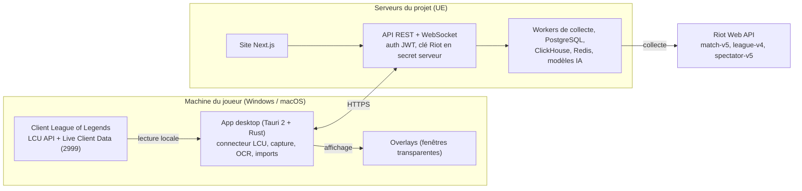

# Cahier des charges — Open LoL Companion

Version du 29/09/2026. Document de référence du projet ; la version de travail collaborative est tenue en parallèle et reportée ici à chaque changement important.

## 1. Contexte, objectifs et périmètre

Objectif : construire une application compagnon League of Legends gratuite et open source, disponible sur **Windows et macOS**, qui couvre les fonctionnalités des meilleures apps du marché (la référence utilisée est DPM.LOL, site de stats + app desktop). On reproduit des fonctionnalités, jamais le code, le nom, le logo ni les visuels d'un autre produit.

**Référence du marché (sept. 2026)** : DPM.LOL propose un site de stats gratuit (builds, tierlists, profils, leaderboards, matchups, Data Studio, esports) et, depuis le 26/09/2026, une app desktop native sans Overwolf, réservée à son offre Premium (4,99 €/mois). Cette app n'existe que sur Windows : le support Mac et la gratuité totale sont nos deux différences majeures.

**Périmètre**

| Brique | Contenu | Priorité |
| --- | --- | --- |
| App desktop | Draft IA, import runes/sorts/items, overlays, enregistrement, replays, post-game, collection, spectate | P1 |
| Site web | Tierlist, builds, profils, leaderboards, matchups, Data Studio, pro/esports | P1 (base) / P2 (avancé) |
| Backend data | Collecte Riot API, agrégation, modèles IA, API interne | P1 |
| Open source | Dépôt public, CI, releases, documentation contributeurs, dons | P1 |
| Communauté | Leaderboards Discord, alertes, pages /pro | P3 |

**Hors périmètre** : TFT, Valorant, mobile natif (le site reste responsive), partage de clips en ligne (prévu plus tard).

**Utilisateurs cibles** : joueurs ranked Fer à Challenger, joueurs ARAM / ARAM Mayhem / Swiftplay, créateurs de contenu (clips), équipes amateurs.

**Question ouverte** : nom définitif du produit et nom de domaine (« Open LoL Companion » est un nom de travail).

## 2. Cadre légal et conformité Riot

La conformité Riot est la condition de survie du produit : une clé API révoquée coupe toutes les fonctions. Chaque fonctionnalité doit être validée contre la [Developer API Policy](https://support-developer.riotgames.com/hc/en-us/articles/22698698001939) avant développement.

**Interdit (bloquant)**

- Utiliser une information absente du client de jeu qui donne un avantage (ex. cooldown des ultimes ennemis, interdit depuis le 13/03/2025).
- Automatiser des décisions de jeu, modifier l'objectif du jeu, créer un avantage déloyal.
- Publicité tierce dans le client Riot, les écrans de chargement ou les overlays (politique de mai 2025).
- Overlays imitant l'UI de Riot.
- Injection de code dans le processus du jeu : uniquement des fenêtres superposées externes.

**Autorisé**

- Riot Web API officielle, Data Dragon / CommunityDragon pour les assets.
- League Client API (LCU) locale : tolérée mais non supportée officiellement, peut casser à chaque patch.
- Live Client Data API (port 2999) pendant la partie.
- Financement par dons ou crowdfunding.

**Obligations administratives**

- [ ] Enregistrer le produit sur le Riot Developer Portal et obtenir une clé de production.
- [ ] Faire valider les overlays et le draft IA par Riot avant la sortie publique.
- [ ] Mention légale Riot (« isn't endorsed by Riot Games ») sur le site et l'app.
- [ ] CGU, politique de confidentialité RGPD, mentions légales.
- [ ] Vérifier la disponibilité du nom (INPI, domaine).

Riot exige qu'un overlay ait une version gratuite : notre modèle étant entièrement gratuit, cette règle est respectée d'office.

## 3. Architecture technique et stack Mac / Windows

Choix recommandé : **Tauri 2 (cœur Rust) + React/TypeScript**, un seul code d'interface pour les deux OS, avec des modules natifs par plateforme pour la capture vidéo et les overlays. Plus léger qu'Electron (≈ 10 Mo contre ≈ 150 Mo), ce qui compte pour une app qui tourne pendant la partie. Alternative si l'équipe est surtout JavaScript : Electron.

| Couche | Windows | macOS | Commun |
| --- | --- | --- | --- |
| Shell desktop | Tauri 2, WebView2 | Tauri 2, WKWebView | React 19, TypeScript, Tailwind, Zustand |
| Connexion client LoL | Lecture du lockfile, HTTPS + WebSocket (WAMP) | Idem, chemin `/Applications/League of Legends.app` | Module Rust `lcu-connector` |
| Données en partie | Live Client Data API `127.0.0.1:2999` | Idem | Polling 1 s + événements |
| Overlays | Fenêtres transparentes, click-through, always-on-top (Win32 `WS_EX_LAYERED`) | `NSPanel` non activant, niveau au-dessus du jeu | Rendu React dans chaque fenêtre |
| Capture vidéo | Windows Graphics Capture + NVENC / AMF / QSV, fallback x264 | ScreenCaptureKit + VideoToolbox (H.264/HEVC) | Buffer circulaire, mux MP4 via FFmpeg |
| Capture audio | WASAPI process loopback (par application) | ScreenCaptureKit audio par app (macOS 13+) | Pistes séparées jusqu'à l'export |
| Lecture écran (OCR) | Capture de zone + Tesseract / template matching | Idem | Augments, reliques ARAM |
| Raccourcis globaux | `RegisterHotKey`, layouts AZERTY | Carbon `RegisterEventHotKey` | Remappables |
| Mises à jour | Installeur NSIS/MSI signé, auto-update | DMG notarisé Apple, auto-update | Releases GitHub, canal stable + bêta |

**Backend** : API Rust/Axum (#19), collecteur Rust et PostgreSQL pour les stats agrégées. ClickHouse et Redis restent des extensions d'infrastructure ; stockage objet S3 prévu pour les médias. Site web en Next.js (SEO indispensable pour les pages builds/tierlist).

**Contraintes macOS**

- Autorisations « Enregistrement de l'écran » et « Accessibilité » demandées à l'onboarding, avec écran d'explication.
- Overlays en mode fenêtré sans bordure ; en plein écran exclusif, bascule sur des notifications système.
- Minimum macOS 13 (Ventura) ; Apple Silicon et Intel (binaire universel).
- Signature Developer ID + notarisation (compte Apple Developer 99 $/an).

**Contraintes Windows**

- Windows 10 2004+ (capture audio par processus), Windows 11 recommandé.
- Option « Lancer en administrateur » si le client LoL tourne en admin.
- Mode efficacité Windows 11 quand l'app est minimisée.
- Signature de code (certificat ou SignPath Foundation pour l'open source).

## 4. Module 1 — Socle de l'app desktop

L'app doit s'installer en une minute, se connecter seule au client LoL et rester discrète dans la barre système.

**4.1 Installation et mises à jour**

- Installeur avec assistant, dossier fixe, auto-update silencieux (canal stable / bêta).
- Migration automatique des anciennes installations, conservation des réglages.
- Écran de récupération en cas d'erreur (jamais de fenêtre blanche).

**4.2 Compte et connexion**

- Connexion via le navigateur (site web → retour dans l'app par deep link).
- Écran de connexion plein écran si aucun compte n'est connecté.
- Section « Comptes » : compte Riot détecté, rang, liaison de plusieurs comptes.
- Accueil : suivre le compte League actif, conserver le dernier compte après fermeture du client et distinguer sa consultation du profil d’un autre joueur. La détection locale ne prouve pas la propriété et ne publie aucune association de comptes ; voir [contrat #65](compte-actif.md).
- Déconnexion depuis les réglages.

**4.3 Détection du client LoL**

- Détection auto du processus `LeagueClientUx`, lecture du lockfile, reconnexion après redémarrage du client.
- Suivi de la phase de jeu (`/lol-gameflow/v1/gameflow-phase`) : Lobby, Matchmaking, ChampSelect, InProgress, EndOfGame.
- Bascule automatique de l'écran de l'app selon la phase.
- Option « Reprendre le focus après un pick ou un ban ».

**4.4 Onboarding au premier lancement**

1. Choix de la langue.
2. Présentation des fonctions.
3. Style des overlays (Dark / Plein) et opacité, avec aperçu réel.
4. Enregistrement : Off / Clips / Partie entière, qualité.
5. macOS : demandes d'autorisations écran et accessibilité.

**4.5 Dashboard**

- Compte actif : profil et historique fournis par la LCU, provenance et limites visibles ; les profils distants gardent le service public.
- Amis du client : liste locale, présence et profil si identité complète ; [contrat #71](amis-client.md). Aucun suivi manuel ou action sociale dans ce lot.

- Profil résumé (rang, LP, winrate récent), historique de matchs.
- Dernière partie enregistrée, accès direct au profil.
- Liste des parties live (jusqu'à 100 sans ralentissement), filtre épinglé.

**4.6 Réglages**

- Deux groupes : **App** (Général, Enregistrement) et **League of Legends** (Jeu, Overlays, Highlights).
- Recherche locale par nom, synonymes et formulations courantes ; résultats directement modifiables, catégories secondaires, annulation du dernier changement et état de sauvegarde explicite. Le premier lot couvre les préférences existantes ; voir [contrat des réglages](reglages.md).
- Changement de réglage sans rechargement de l'app.
- Tray : fermer la fenêtre garde l'app active ; lancement au démarrage de l'OS.
- Accélération matérielle activable/désactivable.
- Export des logs app + LoL en zip pour le support. Premier lot sûr : journal technique de session à codes fermés et résumé facultatif de logs LoL choisis explicitement, sans lignes brutes ni identités ; limites et extension future détaillées dans [les réglages](reglages.md#export-local-des-diagnostics).

**4.7 Langues** : français, anglais, espagnol, portugais, italien, allemand, coréen (traduction complète, pas seulement les menus).

## 5. Module 2 — Assistant de draft (champion select)

Dès le début des bans, l'app propose le meilleur pick pour la composition et importe le build en un clic. Source : WebSocket LCU `/lol-champ-select/v1/session`.

**5.1 Vue draft en direct**

- Bans et picks affichés en temps réel, chrono du tour en cours.
- Bouton « Lock » visible uniquement quand c'est notre tour.
- Glisser-déposer d'une carte de joueur vers un autre rôle (lane swap, autofill) → recalcul immédiat des suggestions.
- Détection des premades, badges joueurs, pas de doublon avec les comptes anonymes.
- Compte à rebours jusqu'à la partie une fois tous les picks verrouillés.

**5.2 Suggestions IA**

- Chaque champion noté contre la compo ennemie, la synergie alliée et la méta du patch.
- Probabilité de victoire du draft pour les deux équipes, avant tout lock.
- Filtres : maîtrise minimale, pool de champions du joueur, off-meta on/off, recherche par nom.
- Comparaison d'équipes : répartition AD/AP, radar (dégâts, tank, CC, engage, scaling).

**5.3 Page build (après le lock)**

- Runes, plan d'items, ordre de montée des sorts, sorts d'invocateur.
- Builds communauté (winrate / popularité) et builds pro côte à côte.
- Par défaut : build tierlist ; un clic sur un champion ennemi → builds contre ce matchup. Option : matchup direct automatique.
- Runes éditables sur place, bouton « Réinitialiser ».

**5.4 Import dans le client**

| Élément | Endpoint LCU | Règle |
| --- | --- | --- |
| Page de runes | `/lol-perks/v1/pages` | Nommée « [Marque] : Champion », remplace l'ancienne page de l'app, pas deux secondaires de la même ligne |
| Sorts d'invocateur | `/lol-champ-select/v1/session/my-selection` | Respect de la position Flash (D/F) choisie par l'utilisateur |
| Set d'items | `/lol-item-sets/v1/item-sets/{summonerId}/sets` | Affiché en premier dans la boutique, items « larme » importés sous forme achetable |

- Import automatique ou manuel, activable séparément pour runes, sorts et items.
- Parcours minimal #63 : une tentative par draft/champion/poste/catégorie ; le
  verrouillage et les modifications manuelles ultérieures dans LoL ne réimportent
  pas. Décision du 3 octobre 2026 : sorts les plus joués inclus sur option séparée,
  Flash D/F explicite ; les détails et limites figurent dans
  [le contrat d'import automatique](imports-automatiques.md).

**5.5 Modes de jeu**

- **Faille** (Ranked Solo/Flex, Normal, Ranked 5v5).
- **ARAM / ARAM Mayhem** : écran dédié avec coéquipiers et banc, winrate ARAM par champion, échange en un clic, build ARAM importé dès l'arrivée du champion ; en Mayhem, pas de runes, place aux items.
- **Builds fun** (ARAM) : styles hors méta ayant réellement gagné, jamais importés automatiquement.
- **Swiftplay** : deux champions choisis avant la file, un build par champion, les deux envoyés au client.
- **Arena** : écran de fin de partie dédié ; recommandations d'augments à prévoir.

## 6. Module 3 — Overlays in-game

Chaque overlay est une fenêtre transparente indépendante, activable séparément, avec son raccourci et un aperçu dans la page « Overlays ». Données : Live Client Data API (`/liveclientdata/allgamedata`, `/eventdata`) et, pour deux overlays, lecture d'écran.

| Overlay | Ce qu'il affiche | Source | Par défaut |
| --- | --- | --- | --- |
| Probabilité de victoire | % de victoire en direct, courbe | Modèle IA sur données live | On |
| Différence d'or | Barre des totaux d'équipe sur le tableau des scores (Tab) + marqueur par lane | Valeur des items de chaque joueur | On |
| Timers d'objectifs | Dragon, Larves, Héraut, Baron, Ancien ; apparition X min avant (5 par défaut) ou permanent | Événements de kill + temps de respawn | On |
| Buffs d'objectifs | Qui a le buff Baron/Ancien, durée restante, joueurs morts exclus | Événements + état des joueurs | Off |
| Benchmark | CS/min, vision… vs moyenne du rang ou vs adversaire direct | Live Client Data + stats backend | On |
| Suggestions d'items | Item conseillé à chaque retour base selon le matchup | Backend + inventaire live | On |
| Rappels | Sort à maxer, changement de trinket | Niveau + items live | On |
| Alertes / notifications | Pile d'alertes (haut ou bas), secondes entières | Tous modules | On |
| Tiers d'augments (Mayhem) | Tier S+ à D sous chaque carte d'augment, adapté au champion | Lecture d'écran (OCR) | Off (bêta) |
| Timers de reliques (ARAM) | Timer sur chaque relique de soin de la minimap | Lecture du scoreboard (Tab) | Off (bêta) |

**Personnalisation**

- Éditeur d'overlays (Alt+B par défaut) : déplacer et redimensionner chaque panneau ; déplacement direct en jeu aussi.
- Style global : **Dark** (flou) ou **Plein** (opaque), opacité 0–100 %.
- Toutes résolutions (1366×768 à ultrawide), multi-écrans, HDR, mise à l'échelle Windows > 100 %, Retina.
- Raccourcis compatibles AZERTY (touche ²).

**Règles techniques**

- Impact FPS < 2 %, CPU < 3 % en moyenne pendant la partie.
- Overlays qui survivent au changement de résolution et à plusieurs parties d'affilée.
- En plein écran exclusif : alertes seulement.
- **Conformité** : aucune info cachée sur l'ennemi. Les deux overlays OCR doivent être validés par Riot avant sortie.

## 7. Module 4 — Enregistrement, clips et replays

L'app enregistre les parties en arrière-plan et repère kills et objectifs. La capture ne tourne que pendant une partie LoL, jamais en dehors.

**7.1 Modes d'enregistrement** : Off / Clips (buffer) / Partie entière.

- **Replay instantané** : buffer circulaire, raccourci (Ctrl+F10 par défaut) sauvegarde les N dernières minutes (1 à 10, 2 par défaut), sans réencodage.
- **Partie entière** : 1080p30 par défaut (≈ 3,9 Go pour 45 min), rétention 3 parties ou 50 Go.
- **Clips auto** : First Blood, Double à Penta kill, Ace, Baron/Dragon volé… (off par défaut), durée avant/après réglable.

**7.2 Qualité et encodage**

| Réglage | Valeurs |
| --- | --- |
| Résolution / FPS | 720p30 → 1440p60 |
| Codec | H.264, HEVC |
| Encodeur | Windows : NVENC, AMF, QSV, x264 ; Mac : VideoToolbox |
| Avancé | Choix du GPU, backend de capture, bitrate, framerate |
| Stockage | Dossier au choix, plafond 5–500 Go, jauge d'espace |

**7.3 Audio**

- Son du jeu + micro sur piste séparée (vumètre de test).
- Choix des applications capturées, pistes séparées jusqu'à l'export.
- Normalisation du volume, son « clip sauvegardé » réglable jusqu'à 200 %.

**7.4 Lecteur de replay**

- Liste des moments à côté de la vidéo, un clic pour y aller.
- Timeline avec APM et tous les événements, filtrables.
- Vitesse de lecture, volume mémorisé, découpe d'un clip depuis un moment ou la position en pause.
- Rognage par poignées, export réencodé à l'image près.

**7.5 Bibliothèque « Enregistrements »**

- Clips et parties dans une même grille ; filtres par type, date, durée, champion, mode, texte.
- Survol = lecture, glisser sur la vignette = navigation.
- Renommer, favori (jamais supprimé automatiquement), jauge disque.

**7.6 Notifications** : carte « Replay prêt » avec aperçu ; cartes « Clip en cours » puis « Clip sauvegardé ».

## 8. Module 5 — Post-game, collection, spectate

**8.1 Analyse post-game (4 vues)**

1. **Scoreboard** : note de la partie sur 100, badges MVP / ACE, objectifs par équipe, bans, comparaison kills / or / dégâts / vision.
2. **Loadout** : runes, items et ordre de sorts de chaque joueur.
3. **Détails** : stats par joueur (CS, dégâts, vision, KP, or par minute).
4. **Avancé** : stats de gameplay profondes, APM, courbes d'or/XP, écart avec l'adversaire de lane.

Écran dédié pour Arena. Données : Riot API match-v5 (+ timeline).

**8.2 Collection de skins** : skins possédés / total, % de complétion, RP dépensés ; filtres champion, set, rareté, disponibilité ; vues Tous / Possédés / Manquants.

**8.3 Spectate des pros en 1 clic** : liste des pros / streamers en partie, lancement via le client LoL, multi-régions (spectator-v5).

**8.4 Parties live** : pour n'importe quel joueur, les 10 participants, rangs, champions, runes, premades, badges.

## 9. Module 6 — Site web de stats

Next.js, SEO par page champion, recherche globale Ctrl+K (joueur, champion, équipe, pro). Tout est gratuit.

| Page | Fonctions |
| --- | --- |
| Tierlist & builds | Tier par rôle, filtres rang / période / région, winrate, pickrate, banrate ; données rafraîchies toutes les heures |
| Page champion | Runes, items, sorts triés par pickrate, ordre des compétences, builds pro, contres, synergies |
| Matchups | Stats champion vs champion, conseils |
| Profil joueur | Historique, stats par champion, rang, peak elo, parties live |
| Suivi LP | Courbe des LP dans le temps |
| Page /pro perso | Page publique personnalisée, comptes liés |
| Leaderboards | Classements par région ; leaderboards personnalisés illimités |
| Leaderboards Discord | Bot : classements et alertes dans un serveur |
| Data Studio | Explorateur de stats : filtres croisés, graphiques, export |
| Team SoloQ | Suivi de la SoloQ des joueurs pros par équipe |
| Esports | Calendrier, classements, rosters, stats, pick'ems |

**Exigences** : responsive mobile, chargement < 2 s, pagination des gros profils, pas de mélange de régions, transferts de région gérés.

## 10. Backend data, modèles IA et API

La qualité des builds et du draft dépend du volume de parties collectées : c'est le vrai actif du produit.

**10.1 Collecte (Riot API)**

- Seed des joueurs via league-v4 (toutes régions, tous rangs), puis crawl match-v5 + timelines.
- account-v1 / summoner-v4, champion-mastery-v4, spectator-v5.
- Respect strict des rate limits (file par région, backoff), clé de production obligatoire.
- Files séparées : Ranked Solo, Flex, Ranked 5v5, ARAM, Mayhem, Swiftplay, Arena.
- Décision du 4 octobre 2026 (#90) : une campagne de collecte vise par défaut Solo (420) et Flex (440) ; les autres files (ARAM, Swiftplay, Arena…) sont collectées sur demande, en les listant explicitement (`campaign --queues`).

**10.2 Agrégation** : par patch, rang, région, rôle ; recalcul horaire de la tierlist ; seuils minimaux d'échantillon ; données statiques par patch mises à jour automatiquement.

Extension de #18 (1er octobre 2026) : collecte Rust reprenable sur les plateformes
Riot, toutes les files accessibles des historiques et les deux patches récents ;
observations horodatées des rangs Solo/Flex, sans prétendre connaître le rang historique.
Synchronisation atomique Data Dragon FR/EN (champions standard/Classic, compétences,
objets, runes, sorts et catalogues). Agrégats par patch/plateforme/file/rôle/rang,
winrate, part des sélections, bans par draft, builds, achats et ordre des compétences ;
seuils et couvertures explicites, tiers descriptifs à partir de la borne Wilson.
Une campagne de recette peut tourner jusqu'à 24 h avec rotation des régions et
reprise. L'accès à tous les modes ne garantit pas un échantillon exhaustif ou
représentatif ; les seeds restent issus du classement. Les modes non classés ne
reçoivent pas un rang compétitif inventé. Le #19 reste responsable de l'API.
Voir [le contrat complet](../services/collector/README.md) et
[la recette étendue](recettes/2026-10-01-agregation-complete.md).

Sous-ticket #61 : référentiel normalisé FR/EN par publication, enrichissement
CommunityDragon versionné des objets et fragments, sources immuables et
reconstruction hors ligne. Les valeurs, unités, contradictions et champs non
interprétés sont exposés par l’API (liste, détail, filtres, diff). Les catalogues
globaux non versionnés restent datés et distincts des ressources par patch.
Le [contrat et la matrice des usages](catalogue-jeu.md) séparent ce référentiel
des nouvelles agrégations #39/#41/#42, modèles IA et écrans aval.

**10.3 Modèles IA**

| Modèle | Entrée | Sortie | Réentraînement |
| --- | --- | --- | --- |
| Draft | 10 champions + rôles, maîtrise, patch | Score par champion, % victoire du draft, prédiction de rôle | À chaque patch |
| Win probability live | Or, kills, objectifs, tours, niveaux, temps | % victoire par équipe | Mensuel |
| Note de partie /100 | Stats joueur vs benchmark rang/rôle | Score + MVP/ACE | Par saison |
| Tiers d'augments | Winrate augment × champion | Tier S+ à D | À chaque patch |
| Détection de moments | Événements + timeline | Horodatage des clips | — |

**10.4 API interne** : REST + WebSocket pour l'app, authentification JWT, cache CDN pour les données statiques.

Choix du #19 (1er octobre 2026) : Rust/Axum dans `services/api`, instantanés #18
et contrats TypeScript partagés. Profils par Riot ID actuel, classements horodatés
et historique match-v5 paginé, sans identités adverses ni parties personnalisées
publiques. Quotas PostgreSQL communs au collecteur et à l'API ; JWT de lecture
émis côté serveur, connexion utilisateur/RSO distincte. WebSocket d'annonce des
publications ; statiques FR/EN avec ETag et cache CDN. La fenêtre temporelle est
celle du calcul publié. Voir [le contrat API](../services/api/README.md).

## 11. Modèle économique : gratuit et open source

Toutes les fonctionnalités sont gratuites, sans publicité, et le code est publié en open source.

| Sujet | Choix |
| --- | --- |
| Licence | MIT |
| Financement des serveurs | Dons : GitHub Sponsors, Open Collective ; dépenses publiées |
| Clé API Riot | Jamais dans le dépôt ni dans l'app : elle reste dans les secrets du backend |
| Contributions | Issues + pull requests, revue obligatoire, CI sur chaque PR |
| Distribution | Releases GitHub signées (Windows + macOS), mises à jour automatiques |

## 12. Exigences non fonctionnelles

| Domaine | Exigence mesurable |
| --- | --- |
| Performance en jeu | Perte de FPS < 2 % overlays actifs, < 5 % avec enregistrement ; RAM app < 300 Mo |
| Démarrage | App prête < 3 s ; import du build < 1 s après le lock |
| Replay | Replay disponible < 30 s après la fin de partie |
| Disponibilité backend | 99,5 % mensuel, dégradation propre si l'API Riot tombe |
| Compatibilité | Windows 10 2004+ / 11 (x64) ; macOS 13+ (Apple Silicon et Intel) |
| Sécurité | Aucun mot de passe Riot stocké ; tokens dans le trousseau OS ; HTTPS partout |
| RGPD | Consentement, export et suppression des données, hébergement UE |
| Vie privée | Capture uniquement pendant une partie LoL, désactivée par défaut |
| Accessibilité | Contrastes AA, navigation clavier |
| Observabilité | Crash reporting, télémétrie anonyme opt-in, export de logs |
| Qualité | Tests auto sur chaque patch LoL, bêta publique avant chaque release |

## 13. Planning et rôles

| Lot | Contenu | Durée indicative | Sortie |
| --- | --- | --- | --- |
| 0. Cadrage | Nom, maquettes, validation Riot, clé API, infra | 1 mois | — |
| 1. MVP | Socle app, connexion LCU, draft basique, imports, site tierlist + builds + profils | 3 mois | Bêta fermée |
| 2. Overlays | Overlays principaux, éditeur, styles, multi-résolution, Mac | 2 mois | Bêta publique |
| 3. Enregistrement | Buffer clips, partie entière, bibliothèque, lecteur, clips auto | 3 mois | V1 |
| 4. IA et avancé | Modèle draft, win probability, post-game 4 vues, benchmark | 2 mois | V1.5 |
| 5. Modes et communauté | ARAM/Mayhem/Swiftplay/Arena, augments, collection, spectate, Discord, Data Studio, esports | 2 mois | V2 |

Durées estimées pour une équipe de 6 ; en open source, le rythme dépend des contributeurs.

| Rôle recherché | Mission |
| --- | --- |
| Dev desktop (Rust) | Tauri, capture vidéo, overlays, modules natifs Win/Mac |
| Dev front React | App + site Next.js |
| Dev backend / data | Collecte Riot API, agrégation, API |
| Data scientist | Modèles draft, win probability, notes |
| UI/UX designer | Design system, maquettes |
| QA / support | Tests sur chaque patch, Discord |

**Coûts incompressibles** : infra (≈ 1 000 à 3 000 €/mois une fois le site public, bien moins au démarrage), Apple Developer 99 $/an, signature Windows (ou gratuite via [SignPath Foundation](https://signpath.org)).

## 14. Critères de recette

Chaque lot est validé sur Windows 11 et macOS (Apple Silicon).

- [ ] L'app détecte le client LoL en < 5 s et survit à son redémarrage.
- [ ] Runes, sorts et set d'items importés correctement pour 100 % des champions du patch, en Faille, ARAM, Mayhem et Swiftplay.
- [ ] Les suggestions de draft se recalculent en < 500 ms après un lane swap.
- [ ] Chaque overlay s'affiche au bon endroit en 1080p, 1440p, ultrawide et Retina, AZERTY inclus.
- [ ] Perte de FPS < 2 % (overlays) et < 5 % (enregistrement) sur une config de référence.
- [ ] Un clip est sauvegardé en < 3 s ; un replay complet est prêt en < 30 s.
- [ ] Aucun overlay n'affiche une information invisible dans le client.
- [ ] N'importe quel contributeur compile l'app Windows et Mac depuis le dépôt en suivant le README.
- [ ] Tests de non-régression passés sur le dernier patch LoL.

## Sources

- [DPM.LOL — page Premium](https://dpm.lol/premium)
- [DPM.LOL — Changelog](https://dpm.lol/changelog)
- [Riot — Developer API Policy](https://support-developer.riotgames.com/hc/en-us/articles/22698698001939)
- [Interdiction du suivi des ultimes ennemis (Softonic)](https://en.softonic.com/articles/riot-games-will-stop-allowing-third-party-applications-in-league-of-legends)
- [Politique Riot sur les overlays, mai 2025 (LolNow)](https://lolnow.gg/riot-cracks-down-on-overlays-in-league-of-legends-a-long-overdue-clean-up/)
