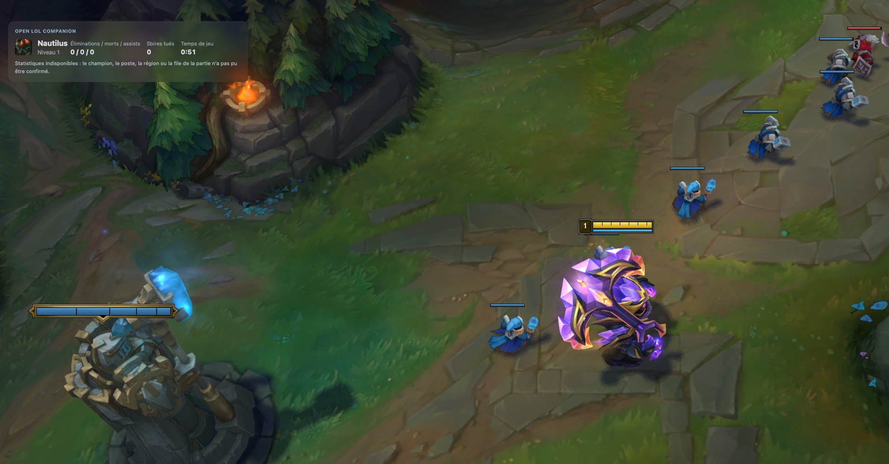

# Recette macOS de l’overlay — 3 octobre 2026 — #22

## Périmètre et méthode

Recette du panneau natif du [ticket #22](https://github.com/bolitow/open-lol-companion/issues/22),
selon les sections 3 et 6 du cahier des charges. Les imports et la qualité des
données de build appartiennent à #63 ; aucun comportement applicatif n’est
modifié par cette recette. Windows reste attribué à Louison.

Matthieu effectue les interactions dans une partie personnalisée réelle et
confirme leurs résultats. Les inspections de l’application native sont réalisées
via son interface accessible. Une capture de la fenêtre du jeu seule peut exclure
le panneau externe : elle ne suffit pas à conclure que l’overlay est absent.

## Environnement et versions

- macOS 27.0, build 26A428 ; Mac mini Apple M4 Pro, 24 Go de RAM, arm64.
- League of Legends : version `16.19.8230722`, lue dans le `Info.plist` du
  bundle GameClient installé ; aucun fichier d’authentification consulté.
- Écrans détectés : R27qe 2560 × 1440 à 144 Hz, PL2445H 1920 × 1080 à 100 Hz,
  C24F390 1920 × 1080 à 60 Hz. La présence de trois écrans ne valide pas à elle
  seule les changements d’écran. Aucun écran Retina n’est identifié dans ce relevé.
- Série A : binaire déjà ouvert au début de la recette, version applicative 0.1.0 ;
  SHA-256 `533778f57b6039348cac746121f6d6e3b494a340395ce9f09b881c436c1cba6e`.
  Le commit de construction de ce binaire préexistant n’est pas démontré.
- Série B : reconstruction debug du commit `31c8d791b0ad9410b860c1690ac24e52d47c5d10`,
  sans changement de code ; SHA-256 du binaire
  `1634ce295deceb21bd65bb0147f9a2bf0b2f4584997473af4258324fab46534b`.
  Bundle reconstruit puis relancé pendant la séance. Le client indiquait alors
  « Hors partie » : la reprise au milieu d’une partie n’est donc pas validée
  par cette relance. Une deuxième personnalisée est lancée par Matthieu.

Les confirmations de la série A restent attachées à son binaire et ne sont pas
présentées comme des essais rejoués sur la série B.

## Résultats réellement observés

| Scénario | Résultat | Preuve et portée |
| --- | --- | --- |
| Aperçu hors partie | Validé sur A pour le déclenchement | L’interface passe à « Affiché », bouton « Arrêter l’aperçu », focus conservé dans les réglages. Durée exacte de 30 s non chronométrée. |
| Panneau au-dessus de League | Validé sur A | Confirmation de Matthieu et capture fournie à 08:56:39, heure de Paris : Nautilus, niveau 1, K/D/A 0/0/0, CS 0, temps 0:51. |
| Lisibilité du panneau | Validé sur la capture A | Textes et données visibles sans troncature ; fond translucide. Les autres résolutions ne sont pas déduites de cette capture. |
| Clics et clavier traversants, focus du jeu | Validé sur A par Matthieu | Clic droit dans une zone recouverte et touche du jeu : « Oui, clic et clavier fonctionnent ». |
| Retour bureau puis retour dans le jeu | Validé sur A par Matthieu | Cmd+Tab, attente de 3 s, retour : « Oui, disparition puis retour corrects ». Pas de mesure de latence plus précise. |
| Fermeture du compagnon | Validé pour l’arrêt du processus A | Fermeture par le bouton de la fenêtre principale ; processus du compagnon absent ensuite. Le processus du jeu est encore présent à ce contrôle. |
| Construction et relance de B | Validé | Bundle debug construit depuis le commit ci-dessus, application relancée, connexion au client retrouvée. |
| Deuxième partie et raccourci Ctrl+Option+O | Validé sur B par Matthieu | Après relance du compagnon puis nouvelle personnalisée : « Oui, retour et raccourci fonctionnent ». Deux bascules espacées de 3 s, sans perturbation rapportée. |
| Acceptation fonctionnelle macOS en fin de séance | Confirmée globalement par Matthieu | Après les demandes de relevé FPS et de fin de partie → nouvelle partie sans fermer le compagnon, Matthieu confirme que tout est bon pour #22. Aucun détail supplémentaire par scénario ni valeur FPS n’est fourni. |

La capture ci-dessus est fournie par Matthieu ; elle ne contient ni identité de
joueur ni secret. Le message « Statistiques indisponibles » porte sur le contexte
nécessaire au build, alors que les données locales sont affichées. La cause exacte
du contexte non confirmé n’est pas diagnostiquée dans #22.

## Vérifications automatiques

Depuis un worktree propre au commit de la série B, après
`pnpm install --frozen-lockfile` :

- `pnpm test` : succès ; 255 tests TypeScript et 432 résultats Rust réussis,
  2 recettes catalogue explicitement ignorées.
- `OLC_TEST_DATABASE_URL` est absente : les tests d’intégration PostgreSQL qui
  retournent sans base n’ont pas exercé PostgreSQL. Leur résultat ne constitue
  pas une recette backend ; aucune base du collecteur n’a été modifiée pour #22.
- `pnpm lint` : succès, typage, formatage Rust et Clippy à zéro erreur.
- `pnpm --filter @olc/desktop tauri build --debug --bundles app` : succès.
  Avertissement Vite sur la taille du bundle, sans échec de compilation.

Le cache Cargo est réutilisé via `CARGO_TARGET_DIR` ; les sources compilées sont
celles du worktree de recette. Les résultats automatisés ne remplacent pas les
essais réels ni les mesures de performance.

## Premier relevé CPU

Après la fin de la compilation, des tests et de Clippy, un relevé de 61 échantillons
espacés d’une seconde couvre 60,193 s. Méthode : différence du temps CPU cumulé
(`ps -axo pid=,time=,rss=,comm=`) divisée par le temps monotone écoulé ; 100 %
représente un cœur. L’ensemble des processus retenus est stable sur le relevé.

- Processus Rust du compagnon B : **0,731 % CPU moyen**.
- Compagnon B + **tous** les services WebKit WebContent/GPU/Networking de la
  session : **2,293 % CPU moyen**. Ce total inclut d’autres applications et est
  donc une majoration du CPU des processus du compagnon, pas leur attribution
  précise. Il ne mesure pas la charge GPU ni le coût de WindowServer.
- Le relevé accompagne la demande de comparaison panneau désactivé/activé ;
  les bascules n’ont pas de marqueur synchronisé avec ces échantillons.
  Il ne constitue donc pas une mesure isolée de 60 s avec overlay actif en continu.

Cette première mesure est compatible avec la cible CPU sur l’intervalle relevé,
mais ne valide pas tous les scénarios ni le budget FPS. Les processus backend
préexistants ont été laissés en fonctionnement ; aucun service n’a été arrêté
pour améliorer artificiellement ce résultat.

## Confirmation finale de Matthieu

Le 3 octobre 2026, Matthieu confirme que tout est bon pour #22, dans le cadre de
la recette macOS en cours. Cette confirmation clôt les demandes de retour manuel
de cette séance : la recette fonctionnelle est acceptée sur sa configuration.

Cette acceptation globale est distincte des preuves détaillées du tableau. Elle
ne fournit pas de relevé supplémentaire pour chaque scénario : reprise pendant
une partie, fin/reconnexion, deux parties avec le même processus, minimisation,
modes de fenêtre/Spaces, changements d’écran/résolution, réglages et transparence.
Les essais observés sur A ne deviennent pas des essais instrumentés sur B.

## Portée de la validation et compléments à consigner

- Aucun relevé FPS avec/sans panneau ni indication d’un éventuel plafonnement
  n’est consigné. Le premier relevé CPU conserve les limites décrites ci-dessus.
  L’acceptation fonctionnelle ne chiffre donc pas les budgets de perte FPS < 2 %
  et CPU < 3 % pour l’application complète.
- macOS 13–25, Intel et Retina n’ont pas été testés dans cette séance ; la
  confirmation sur le Mac mini décrit plus haut ne couvre pas ces configurations.
- Recette Windows par Louison ; validation Riot avant publication publique.

**Statut : recette fonctionnelle macOS acceptée par Matthieu sur sa configuration ;
ticket #22 ouvert pour la validation globale.** #23 et #63 ne sont pas déclarés
terminés par ce document.
