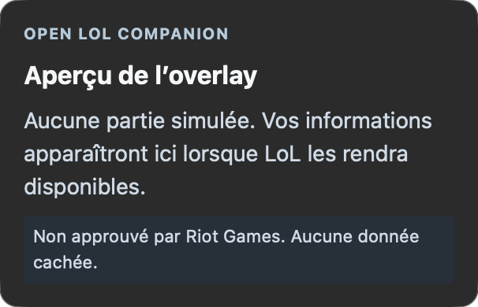
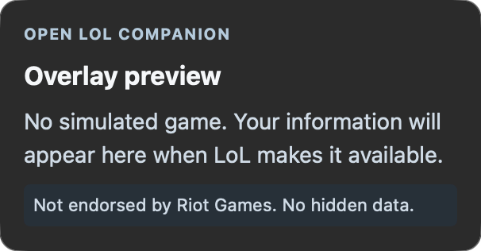

# Recette native de la mention légale de l'overlay — #187

Date : 6 octobre 2026. Cette recette complète la livraison #193 et les contrôles
de son réglage d'estimation et du paquet distribué. Elle vérifie le **vrai panneau
natif séparé**, en aperçu hors partie, sans données simulées de joueur.

## macOS

macOS 27.0, Apple Silicon. Application embarquée de la recette #94, sur base
`c56291a99afb324ae1d9d99061cea968e60cd3d5` avec correction d'historique.
SHA256 de l'exécutable effectivement utilisé :
`03c668ae5a04e0af2f02764d29537c8473144f852ba31223d611bece573aa472`.
Les sources de l'overlay, son entrée et son contrat partagé sont inchangés entre
cette base et `bd27801421917fdf395a1c233422e04ecad26a35`. Cette observation n'est
pas attribuée à un nouveau bundle de main.

L'aperçu est lancé depuis les réglages de l'application native. Les captures CUA
de la fenêtre principale n'incluaient pas le NSPanel ; l'utilisateur a donc
explicitement autorisé une capture native macOS limitée à ce panneau.

L'identification retient l'exécutable exact ci-dessus, puis l'unique fenêtre
visible au niveau flottant 3 appartenant à ce processus. Le titre réellement
relevé est « Open LoL Companion Overlay ». La commande `screencapture -x -o -a
-l<windowID>` capture cette seule fenêtre, sans ombre ni fenêtre attachée.
Il n'y a ni capture du bureau ni changement des autorisations système.

Réglages : panneau désactivé hors aperçu, plein écran exclusif désactivé,
écran 1, placement 2 % / 18 %, largeur 20 %, hauteur automatique, style Dark,
opacité 90 %. La langue du panneau est enregistrée en FR puis en EN.

| Langue | Taille logique du panneau | Observation |
| --- | --- | --- |
| FR | 303 × 195 points | « Non approuvé par Riot Games. Aucune donnée cachée. » visible en entier en bas du panneau |
| EN | 303 × 158 points | « Not endorsed by Riot Games. No hidden data. » visible en entier en bas du panneau |

Le panneau adapte sa hauteur au texte ; les captures sont des images Retina
de 606 × 390 et 606 × 316 pixels. La mention est lisible sans troncature ni
recouvrement du contenu de l'aperçu.

Empreintes SHA256 des images :

- FR : `29b6ce4e82fb5e4f3b7bb248ae95ca99d461616e3f1d83061807406e351e5612`.
- EN : `e1766d7c7e0f1e813046a4c3dad001db4482129849dbbe9dcf85a80a4f6d0120`.

Après capture, l'aperçu est arrêté, le changement de langue générale est annulé,
la langue FR du panneau réenregistrée. Les préférences persistées sont relues :
`enabled=false`, `exclusiveFullscreen=false`, `monitor=0`, `x=0.02`, `y=0.18`,
`width=0.2`, `height=0`, `opacity=0.9`, `style=dark`, `locale=fr`.

## Windows

Le [compte rendu natif du 6 octobre](https://github.com/bolitow/open-lol-companion/issues/187#issuecomment-6012005945)
documente Windows 11 Pro 25H2 x64 (build 26200.9457), le vrai panneau séparé en
FR/EN, largeur 20 %, hauteur automatique et opacité 90 %. Les deux mentions sont
visibles sans troncature et présentes dans l'arbre d'accessibilité.

Sources exécutées : `acffccb793013b177073bce75f6ba2d552928dcd` ; binaire SHA256
`D07F9E529AA967D1D687B6D60ADDBD61071429EDEF52F9E919F303A2AD3810C9`.
Le [complément de recette](https://github.com/bolitow/open-lol-companion/issues/187#issuecomment-6012554429)
confirme l'accès par Tab en édition sur Windows, la désactivation immédiate du
réglage d'estimation, sa persistance après redémarrage sur les deux OS et le
rétablissement des états initiaux.

Ces contrôles Windows ont déjà été exécutés ; ils ne sont pas réattribués à un
nouveau binaire ni rejoués par la capture macOS.

## Portée et limites

Les captures valident la visibilité FR/EN dans un **aperçu natif**, accepté pour
ce critère de #187. Elles ne valident ni une superposition pendant une partie,
ni un lecteur d'écran réel, ni une navigation clavier macOS dans le NSPanel.
Les tests de composant couvrent le texte et son focus réservé à l'édition ;
la recette Windows couvre Tab. L'estimation en draft réelle relève de #181,
pas de ces images. L'exclusion du prototype et la consommation du réglage ont
leurs contrôles déjà livrés dans #193 ; voir [Présentation du panneau](../live-overlay.md#présentation-et-paquet-distribué-187).

Aucun client Riot ou League n'a été manipulé pour ces captures, aucun accès API
de recette n'a été enregistré et aucun secret ni identifiant de joueur n'est
présent dans les images. Les outils temporaires de capture restent locaux,
sans ajout au code distribué.
